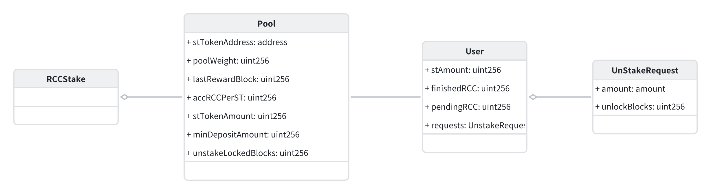
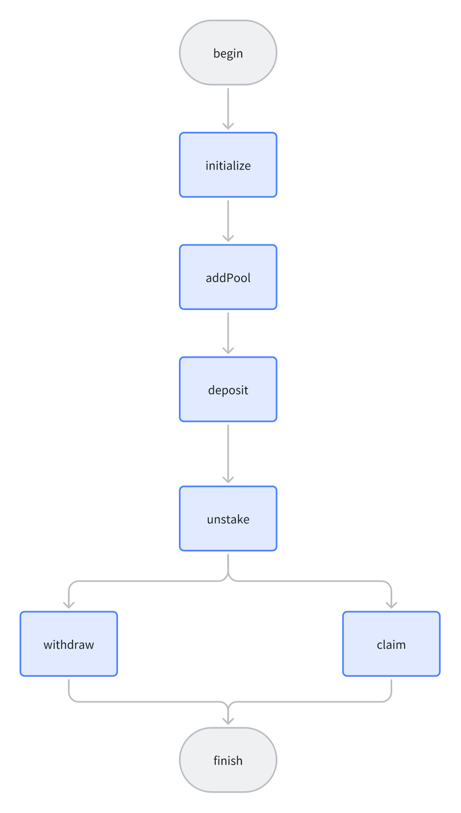

# RCCStake

---
# RCCStake v1

---
# 前言
继原RCCStake项目进行开发，进行功能的衍生。

# 分析
## 1. UML类图

## 2. 流程图
### 以一个池子的生命周期为例

## 3. 功能
### RCCStakeLib.sol -- 将除了_deposit的内部方法都隔离出来（_deposit中需要记录event）
#### 1. updatePool (原_update)
作用：每次使用数据前，更新池子的accRCCPerST、lastRewardBlock。

### RCCStake.sol
#### 1. _deposit
作用：更新用户在指定池子中的质押数量的同时更新预获得RCC奖励。

#### 2. addPool
作用：添加池子，初始化添加的池子的参数

#### 3. updatePool(uint256)，massUpdatePools
作用：更新池子（调用lib中的updatePool）

#### 4. depositnativeCurrency
作用：更新以太坊池子（ETH）

#### 5. deposit
作用：指定池子，存入数量

#### 6. unstake
作用：取出质押的钱，钱会放入缓冲区，并更新用户的剩余质押数量和池子的总质押数量。

#### 7. withdraw
作用：撤款，撤除已经缓冲完成的之前取出的质押的钱。

#### 8. chaim
作用：获取质押的利润。

## 4. 单元测试
单元测试重复功太多，为了节省时间仅写了几个方法。
# 小结
- 初步了解了质押，质押池，以及用户如何质押和数据结构的构成。
- 了解了简单质押池的利润获取。也了解了防止用户频繁提取而制作的缓冲的作用。
- 对质押了解的只有冰山一角，再接再厉。

---
# 功能
## 已实现功能
- 质押

## 待实现功能

## 待理解的功能 
参考项目：[stakeMax](https://github.com/zhulida1234/stakeMax)
- 发币
- uniswap
- 跨链支持

## 思考知识（杂乱）
- openzeppelin
- uniswap v2/v3 （优先理解v2）
- NFT
- 等
